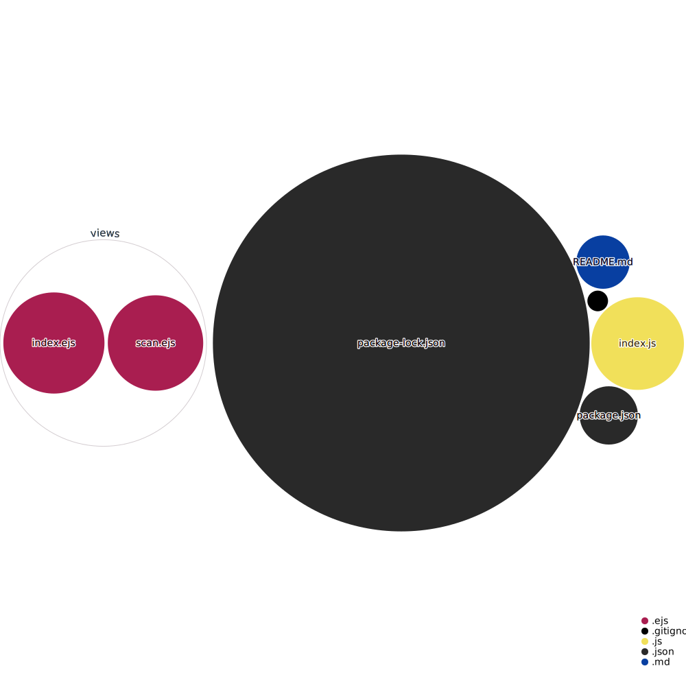

# QR Code Generator

This is a super simple web app that takes in an input string and converts it to a QR Code.

You can start the server by running `node index.js` at the root directory.

We've included the generated diagram by adding it to the README:

